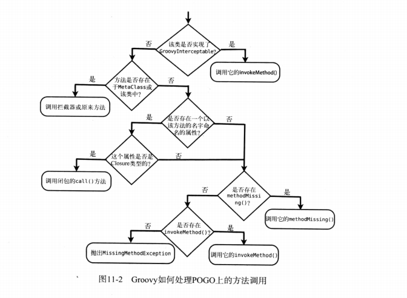
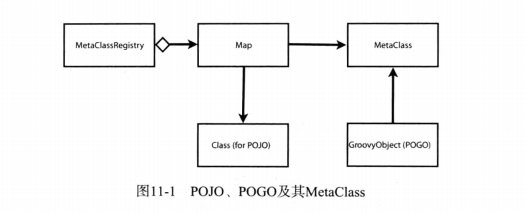

### Groovy 学习案例

Groovy2.5.15 for Windows 参考资料 【Groovy程序设计】

##### 1.相关软件下载

[官网地址](https://groovy.apache.org/index.html "官网地址") <br/>
[下载地址首页](https://groovy.apache.org/download.html "Groovy下载地址首页")<br/>
[Groovy2.5.15下载](https://groovy.jfrog.io/artifactory/dist-release-local/groovy-windows-installer/groovy-2.5.15/groovy-2.5.15.msi "Groovy2.5.15下载地址请点击") <br/>

#### 2.配置环境变量

```
GROOVY_HOME = D:\Program Files (x86)\Groovy
PATH = %GROOVY_HOME%\bin
```

#### 3.其他只是




